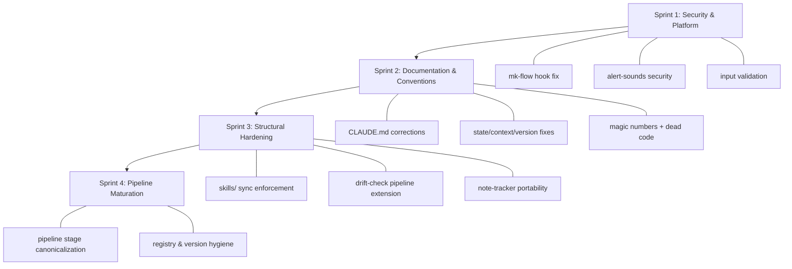

# Plan: Audit Remediation

> **Source:** `artifacts/audits/2026-03-22-cc-marketplace-audit-report.md`
> **Created:** 2026-03-22

## Vision

Remediate 53 audit findings across the cc-marketplace codebase. Fix the critical mk-flow hook platform bug that disables all intent classification and pipeline routing on Windows. Close the PowerShell injection vulnerability in alert-sounds. Correct documentation drift, extract magic numbers, add input validation, and introduce structural enforcement for the skills/ mirror pattern. The goal is a codebase where every stated convention is actually followed, every security boundary is defended, and every cross-plugin contract is enforced.

## Architecture Overview

This is a remediation plan, not a new system design. The fixes are grouped by module to minimize context switches and by dependency to ensure safe ordering.

## Module Map

| Module | Purpose | Key Files | Findings Addressed | Owner (Sprint) |
|--------|---------|-----------|-------------------|----------------|
| mk-flow hook | Intent classification, rules injection, pipeline routing | `plugins/mk-flow/hooks/intent-inject.sh`, `hooks.json` | AC-1, AC-4, RV-5, RV-6, FP-9 | Sprint 1 |
| alert-sounds | Event alerts with sound, notifications, taskbar flash | `plugins/alert-sounds/hooks/alert.py` | RV-1, IQ-5, IQ-6, IQ-8, IQ-9 | Sprint 1 |
| schema-scout | Data file schema exploration CLI | `plugins/schema-scout/…/cli.py`, `index_io.py`, `readers.py` | IQ-2, IQ-4, IQ-7, IQ-10, RV-2, RV-3 | Sprint 1 |
| repo-audit | Codebase audit + amendment protocol | `plugins/repo-audit/…/repo_audit.py` | RV-4 + description injection | Sprint 1 |
| Documentation | CLAUDE.md, STATE.md, vocabulary, cross-refs | `CLAUDE.md`, `context/*.yaml`, `context/STATE.md` | AC-2, AC-3, AC-5, AC-6, AC-8, PC-1–PC-11, GA-1 | Sprint 2 |
| note-tracker | Question + bug tracker | `plugins/project-note-tracker/…/tracker.py`, 13 workflow files | IQ-1, IQ-3, FP-5 | Sprints 2–3 |
| safe-commit | Secret scanning | `plugins/safe-commit/…/scan-secrets.sh` | IQ-11, RV-8 | Sprint 2 |
| skills/ mirror | mk-cc-all skill copies | `skills/` (8 directories) | FP-2, FP-8 | Sprint 3 |
| drift-check | Milestone verification | `plugins/mk-flow/…/drift-check.sh` | FP-3 | Sprint 3 |
| Pipeline stages | Stage name routing | Multiple files across mk-flow, architect, ladder-build, miltiaze | FP-1, FP-4 | Sprint 4 |

## Sprint Tracking

| Sprint | Status | Tasks | Completed | QA Result | Key Changes |
|--------|--------|-------|-----------|-----------|-------------|
| 1 | DONE | 3 | 3/3 | PASS (4 fixes applied) | Security & platform hardening: hook fix, PowerShell injection, input validation |
| 2 | DONE | 3 | 3/3 | PASS | Documentation accuracy, convention compliance, dead code cleanup |
| 3 | DONE | 3 | 3/3 | PASS | Structural enforcement: sync script, drift-check extension, note-tracker portability |
| 4 | DONE | 2 | 2/2 | Awaiting review | Pipeline maturation: stage canonicalization, registry hygiene |

## Task Index

| Task | Sprint | Status | File | Depends On | Parallel |
|------|--------|--------|------|-----------|----------|
| mk-flow hook hardening | 1 | done | `sprints/sprint-1/task-1-mk-flow-hook.md` | None | Yes (with T2, T3) |
| alert-sounds security fix | 1 | done | `sprints/sprint-1/task-2-alert-sounds-security.md` | None | Yes (with T1, T3) |
| Input validation + scout index | 1 | done | `sprints/sprint-1/task-3-input-validation.md` | None | Yes (with T1, T2) |
| CLAUDE.md corrections | 2 | done | `sprints/sprint-2/task-1-claude-md-corrections.md` | Sprint 1 | Yes (with T2, T3) |
| State/context/version fixes | 2 | done | `sprints/sprint-2/task-2-state-context-fixes.md` | Sprint 1 | Yes (with T1, T3) |
| Magic numbers + dead code | 2 | done | `sprints/sprint-2/task-3-magic-numbers-cleanup.md` | Sprint 1 | Yes (with T1, T2) |
| skills/ sync enforcement | 3 | done | `sprints/sprint-3/task-1-sync-enforcement.md` | Sprint 2 | Yes (with T2, T3) |
| drift-check pipeline extension | 3 | done | `sprints/sprint-3/task-2-drift-check-pipeline.md` | Sprint 2 | Yes (with T1, T3) |
| note-tracker portability + cleanup | 3 | done | `sprints/sprint-3/task-3-note-tracker-portability.md` | Sprint 2 | Yes (with T1, T2) |
| Pipeline stage canonicalization | 4 | done | `sprints/sprint-4/task-1-stage-canonicalization.md` | Sprint 3 | Yes (with T2) |
| Registry & version hygiene | 4 | done | `sprints/sprint-4/task-2-registry-hygiene.md` | Sprint 3 | Yes (with T1) |

## Interface Contracts

| From | To | Contract | Format |
|------|----|----------|--------|
| `intent-inject.sh` | Claude context | 5 context files injected as system-reminder XML tags | YAML inside `<rules>`, `<project_state>`, etc. |
| `alert.py` | PowerShell | Sound file path passed via `-ArgumentList` (post-fix) | String path, never interpolated into `-Command` |
| `index_io.py` | `.scout-index.json` | `source_file` = filename (not absolute path), no `source_file_name` field | JSON with `schema_scout_version` matching `__version__` |
| `repo_audit.py` | `_code_audit/amendments/` | Slug validated against `^[a-zA-Z0-9_-]+$` before use in filename | Markdown file |
| `drift-check.sh` | Claude (via rules.yaml) | Handles both `artifacts/builds/*/BUILD-PLAN.md` AND `artifacts/designs/*/PLAN.md` | stdout status report |
| `sync-skills.sh` | `skills/` | Mirror of `plugins/*/skills/*/` excluding `__pycache__` | Directory copy |

## Decisions Log

| # | Decision | Choice | Rationale | Alternatives Considered | Date |
|---|----------|--------|-----------|------------------------|------|
| 1 | skills/ sync mechanism | Sync script (not symlinks) | Windows requires Developer Mode or admin for symlinks. This is a Windows-primary development environment. A sync script is cross-platform safe. | Symlinks (simpler but platform-restricted), manual only (current, error-prone) | 2026-03-22 |
| 2 | `_meta.defaults_version` value | Set to `"0.6.0"` (matching installed plugin) | Setting to `"0.5.0"` would immediately trigger the stale nudge, misleading the user since the project rules content is current. `"0.6.0"` correctly reflects that no update is needed. | `"0.5.0"` (accurate to template origin, but triggers unwanted nudge) | 2026-03-22 |
| 3 | schema-scout plugin vs pyproject.toml versions | Document as independent | Plugin version tracks the skill (SKILL.md, workflows, references). pyproject.toml tracks the Python package. They serve different audiences and may advance at different rates. Add a cross-reference rule documenting this. | Sync them (simpler but conflates two release cycles) | 2026-03-22 |
| 4 | note SKILL.md v1.7.0 vs plugin.json 1.6.0 | Bump plugin.json to 1.7.0 | The SKILL.md help text reflects shipped features (the user sees v1.7.0 when invoking `/note help`). The plugin.json lagged behind. Bumping aligns the registry with reality. | Fix SKILL.md to 1.6.0 (accurate to registry but contradicts shipped features) | 2026-03-22 |
| 5 | RV-1 fix approach | Parameterized `-ArgumentList` pattern | Follow the existing `notify_windows.ps1` pattern which already uses `-File` with `-ArgumentList`. Both `_play_file_windows` and `_play_file_wsl` refactored identically. | Escape-hardening (insufficient against all injection vectors), ctypes MediaPlayer (adds dependency) | 2026-03-22 |
| 6 | FP-3 priority | Sprint 3 (not Sprint 1) | Despite being a current correctness issue, the hook must work first (Sprint 1 AC-1). Without the hook, drift-check invocation is moot. Sprint 3 gives proper time for the second parser. | Sprint 1 (immediate, but adds complexity to an already-full sprint) | 2026-03-22 |
| 7 | RV-4 scope expansion | Include description YAML injection fix | Security agent identified that `description` is also interpolated unsanitized into YAML in the same file (repo_audit.py). Same class of vulnerability, same fix location. | Fix slug only, defer description (leaves a known injection in the same file) | 2026-03-22 |
| 8 | tracker.py column constants | Separate constants for Questions and Bugs sheets | Testing agent identified that `column=4` means "Handler Answer" in Questions but "Investigation" in Bugs. Even though the numeric value is the same today, the semantics differ and column positions may diverge if either sheet gains a column. | Single shared constants (incorrect — conflates coincidentally-equal values) | 2026-03-22 |

## Refactor Requests

| From Sprint | What | Why | Scheduled In | Status |
|-------------|------|-----|-------------|--------|
| — | Extract `_run_powershell_media()` helper | After RV-1 fix, `_play_file_windows` and `_play_file_wsl` share identical parameterized invocation logic. Deduplicate to prevent the bug from being re-introduced in one copy. | Sprint 1 (part of T2) | pending |

## Risk Register

| Risk | Likelihood | Impact | Mitigation | Status |
|------|-----------|--------|-----------|--------|
| PowerShell injection via crafted config.json path | Med | High | Sprint 1 T2 — parameterize invocation | Active |
| Existing .scout-index.json files have old format | Low | Low | load_index handles both old and new format gracefully | Active |
| skills/ mirror drifts silently after code changes | High | Med | Sprint 3 T1 — sync enforcement script | Active |
| drift-check produces wrong results in pipeline mode | High | Med | Sprint 3 T2 — extend for PLAN.md format | Active |
| New plugin added without marketplace/skills/ entries | Med | Low | Sprint 3 T1 — consistency check in sync script | Active |
| Pipeline stage name added without updating all locations | Med | High | Sprint 4 T1 — canonical reference + cross-reference rule | Active |

## Change Log

| Date | What Changed | Why | Impact on Remaining Work |
|------|-------------|-----|-------------------------|
| 2026-03-22 | Initial plan created from audit findings | 53 findings across 6 perspectives, synthesized via 4-agent design analysis | Sprints 1-4 defined |
| 2026-03-22 | Sprint 1 executed — 3/3 tasks complete | All acceptance criteria passed (27/27). Version bumps deferred to Sprint 2. | Sprint 2 next |
| 2026-03-22 | Sprint 1 QA review — 4 autonomous fixes | PS param() binding fix, backslash sanitization, NDJSON message format, Windows Popen try/except. Decision 5 amended: single-quote embedding replaces -ArgumentList pattern. | IQ-2 added to Sprint 2 scope |
| 2026-03-22 | Sprint 2 executed and QA passed | 25/25 criteria. Clean sprint, no fixes needed. STATE.md version line + filtered_findings cleanup added to Sprint 3. | Sprint 3 next |
| 2026-03-22 | Sprint 3 executed and QA passed | skills/ sync enforcement script, drift-check pipeline extension (PLAN.md parser), note-tracker portability (13 workflow + tracker.py fixes). | Sprint 4 next |
| 2026-03-22 | Sprint 4 in progress — Task 1 complete | Pipeline stage canonicalization: canonical STAGE_NAMES constant in intent-inject.sh, state.md template enum, stage-names cross-reference rule. | Task 2 (registry hygiene) executing |
| 2026-03-22 | Sprint 4 Task 2 — Registry & version hygiene | Bumped mk-flow→0.8.0, note-tracker→1.8.0, safe-commit→1.0.1, schema-scout→1.2.1, mk-cc-all→1.16.0. marketplace.json synced. schema-scout-versions + plugin-json-format note added to cross-references.yaml. | Sprint 4 complete pending QA |

## Fitness Functions

- [ ] No string-interpolated path in PowerShell `-Command` construction in alert.py
- [ ] No bare integer `column=N` arguments in tracker.py (all use named constants)
- [ ] No `10_000` literal in cli.py Option calls (uses `DEFAULT_MAX_ROWS`)
- [ ] `source_file_name` key absent from scout index output
- [ ] `source_file` in scout index is not an absolute path (no drive letter prefix)
- [ ] `schema_scout_version` in scout index matches `__version__`
- [ ] CLAUDE.md hook threshold description matches actual `intent-inject.sh` value
- [ ] All plugins in `plugins/` are listed in `marketplace.json`
- [ ] `skills/` directories match `plugins/*/skills/*/` (enforced by sync script)
- [ ] `context/rules.yaml` has `_meta.defaults_version` field
- [ ] `allow_entries=()` declared before use in `scan-secrets.sh`
- [ ] Slug in repo_audit.py validated against `^[a-zA-Z0-9_-]+$`
- [ ] `intent-inject.sh` has LF line endings (no CRLF)
