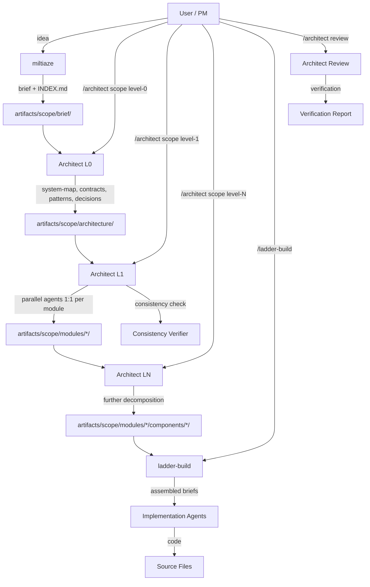

> **type:** plan
> **output_path:** artifacts/designs/cascading-decomposition/PLAN.md
> **source:** artifacts/explorations/2026-04-07-cascading-decomposition-requirements.md
> **created:** 2026-04-07
> **key_decisions:** D1, D2, D3, D4, D5, D6, D7, D8, D9, D10, D11
> **open_questions:** none

# Plan: Cascading Hierarchical Decomposition Pipeline

## Vision
Transform the miltiaze -> architect -> ladder-build pipeline into a multi-level decomposition system where any size project gets broken down through as many levels as necessary until every implementation unit is <=250 lines with zero ambiguity. User-gated fresh sessions between levels, dual representation (human .md + agent .agent.md), parallel decomposition (1 module per agent), and anti-laziness mechanisms throughout.

## Architecture Overview

## Module Map

| Module | Purpose | Key Files | Dependencies | Owner (Sprint) |
|--------|---------|-----------|-------------|----------------|
| Templates | All format definitions for scope/ artifacts | `templates/index.md`, `templates/agent-brief.md`, `templates/decision-record.md`, `templates/interface-contract.md`, `templates/pattern.md`, `templates/consistency-check.md` | None | Sprint 1 |
| References | Decomposition rules, stopping criteria, assembly algorithm | `references/scope-decomposition.md` | Templates | Sprint 1 |
| Extended task-spec | Add hierarchy fields to existing template | `templates/task-spec.md` | Templates | Sprint 1 |
| scope-decompose workflow | Core multi-level decomposition with parallel agents | `workflows/scope-decompose.md` | Templates, References | Sprint 2 |
| Architect routing | SKILL.md routing + intake for scope commands | `SKILL.md` | scope-decompose workflow | Sprint 2 |
| miltiaze scope output | Requirements output to scope/brief/ in dual format | `miltiaze/workflows/requirements.md`, `miltiaze/SKILL.md` | Templates | Sprint 3 |
| ladder-build scope integration | Read from scope/, assembled briefs, overflow detection | `ladder-build/workflows/execute.md`, `ladder-build/SKILL.md` | Templates, scope-decompose | Sprint 3 |
| Pipeline integration | STATE.md stages, .gitignore, cross-references | `mk-flow/`, `context/` | scope-decompose, miltiaze, ladder-build | Sprint 3 |
| scope-discover workflow | Feature flow: scan codebase, map impact | `workflows/scope-discover.md` | Templates, scope-decompose | Sprint 4 |
| Documentation | CLAUDE.md, version bumps, cross-references | Various | All above | Sprint 4 |

## Sprint Tracking

| Sprint | Tasks | Completed | QA Result | Key Changes | Boundary Rationale |
|--------|-------|-----------|-----------|-------------|-------------------|
| 1 | 6 | 6/6 | PASS (8 fixes) | Foundation: all templates + references + extended task-spec. 8 autonomous QA fixes (F3 negation, CHECK 4 tier/level, glob pattern, superseded filter, source_hash). 3 design decisions deferred to user. | Scope boundary: all format definitions exist and parse correctly, no functional changes yet |
| 2 | 5 | 5/5 | PASS (5 fixes) | Core: scope-decompose workflow + architect routing. 5 autonomous QA fixes (F13 optional sections, impl brief validation fields, STATE.md scope_root field, reference_index entry, intake numbering). 2 critical self-contradictions caught and fixed. | Decision gate: can decompose a synthetic project through L0 and L1 |
| 3 | 6 | 6/6 | PASS (5 fixes) | Integration: miltiaze scope output, ladder-build scope integration, overflow detection, STATE.md + .gitignore, cross-references. T22 QA hardening (8 fixes) + T12-T16 integration tasks. 5 autonomous QA fixes (leaf-ready/overflow status, mkdir ordering, line counting alignment, F5 assertion). 7 issues scheduled for Sprint 4. | Scope boundary: full pipeline miltiaze -> architect -> ladder-build works end-to-end with scope/ |
| 4 | 6 | 6/6 | PASS (2 fixes) | Feature flow: scope-discover workflow + feature directory support. QA hardening (7 fixes: H4 H5 H6 M1 M2 M3 M4). Documentation: CLAUDE.md + F11 fix. Version bumps. Calibration: end-to-end trace with 1 bug fix. 2 autonomous QA fixes (slug validation ordering, estimated_lines negative handling). 1 critical escalation (Pattern Extractor parallelization). | Final sprint: feature flow works, all docs updated, calibration validated, AC1-AC6 fully met |

## Task Index

| Task | Sprint | File | Depends On |
|------|--------|------|-----------|
| T1: INDEX.md template | 1 | sprint-1/task-1-index-template.md | None |
| T2: Agent brief templates | 1 | sprint-1/task-2-agent-brief-templates.md | None |
| T3: Small artifact templates | 1 | sprint-1/task-3-artifact-templates.md | None |
| T4: Scope decomposition reference | 1 | sprint-1/task-4-scope-reference.md | T1, T2, T3 |
| T5: Extend task-spec.md | 1 | sprint-1/task-5-extend-task-spec.md | None |
| T6: Consistency check template | 1 | sprint-1/task-6-consistency-template.md | T2 |
| T7: scope-decompose workflow | 2 | sprint-2/task-7-scope-decompose-workflow.md | T1-T6 |
| T8: Parallel agent spawning logic | 2 | sprint-2/task-8-parallel-spawning.md | T7 |
| T9: Brief assembly + system-map template | 2 | sprint-2/task-9-brief-assembly.md | T2, T4 |
| T10: Consistency verification integration | 2 | sprint-2/task-10-consistency-integration.md | T6, T7 |
| T11: Architect SKILL.md routing update | 2 | sprint-2/task-11-skill-routing.md | T7 |
| T12: miltiaze scope output | 3 | sprint-3/task-12-miltiaze-scope-output.md | T1, T2 |
| T13: ladder-build scope integration | 3 | sprint-3/task-13-ladder-build-scope-integration.md | T2, T7 |
| T14: Overflow detection | 3 | sprint-3/task-14-overflow-detection.md | T13 |
| T15: STATE.md + .gitignore integration | 3 | sprint-3/task-15-state-gitignore-integration.md | T7 |
| T16: Cross-references update | 3 | sprint-3/task-16-cross-references-update.md | T7, T12, T13 |
| T22: Sprint 2 QA hardening | 3 | sprint-3/task-22-qa-hardening.md | T7, T8, T9, T11 |
| T23: Sprint 3 QA hardening | 4 | sprint-4/task-23-qa-hardening.md | T12, T13, T14 |
| T17: scope-discover workflow | 4 | sprint-4/task-17-scope-discover.md | T7 |
| T18: Feature scope directory support | 4 | sprint-4/task-18-feature-scope-support.md | T17 |
| T19: CLAUDE.md update | 4 | sprint-4/task-19-documentation.md | T17, T18, T23 |
| T20: Version bumps | 4 | sprint-4/task-20-version-bumps.md | T17, T18, T19, T23 |
| T21: End-to-end calibration run | 4 | sprint-4/task-21-calibration.md | T17, T18, T19, T20, T23 |

## Interface Contracts

| From | To | Contract | Format |
|------|----|----------|--------|
| miltiaze | architect scope-decompose | Project brief + INDEX.md at `artifacts/scope/brief/` | Dual .md + .agent.md, INDEX.md with status "brief-complete" |
| architect L0 | architect L1 | Architecture in `artifacts/scope/architecture/` + updated INDEX.md | system-map, contracts/, patterns/, decisions/ -- all dual format |
| architect LN | architect LN+1 | Module/component specs + updated INDEX.md | overview/spec dual files in modules/*/ |
| architect (leaf) | ladder-build | Leaf task specs in `modules/*/[components/*/]tasks/` | .agent.md in YAML+XML format, .md for human review |
| ladder-build | architect review | Implementation code + completion markers | Source files + INDEX.md status updates |
| scope-decompose | consistency verifier | All sibling specs from current batch | Agent brief with all sibling .agent.md content |
| INDEX.md | all fresh sessions | Project state, module status, file paths | Markdown with structured status table |

## Decisions Log

| # | Decision | Choice | Rationale | Alternatives Considered | Date |
|---|----------|--------|-----------|------------------------|------|
| D1 | API surface for scope commands | Explicit per-level: `/architect scope level-N [target]` | User prefers explicit control over what level is being decomposed | Auto-detect level from INDEX.md state (simpler but less explicit) | 2026-04-07 |
| D2 | Scope directory privacy | Gitignore `artifacts/scope/` by default | Scope files contain architectural details, codebase snapshots, function signatures that could be sensitive | Don't gitignore (user decides); gitignore discovery/ only | 2026-04-07 |
| D3 | INDEX.md write access | Orchestrator-only — parallel agents never write INDEX.md | Concurrent writes cause corruption (280 incidents/day cited in research). Agents write to their own directories, orchestrator reads results and updates INDEX.md | Each agent updates INDEX.md directly (simpler but race-prone) | 2026-04-07 |
| D4 | Dual representation authorship | Co-author: decomposition agents write BOTH .md and .agent.md in a single pass | More tractable than post-processing .md into .agent.md (transformation can't be fully automated). Co-authoring in one pass ensures consistency. | Derive .agent.md from .md via transformation; Generate .agent.md at spawn time (never stored) | 2026-04-07 |
| D5 | Decomposition depth cap | Configurable, defaulting to 5. System warns at depth 4. | User wants unlimited depth but research shows quality degradation beyond 3-4 levels. Cap of 5 gives headroom while preventing runaway. | No cap (user's original preference); Hard cap at 3 (exploration recommendation) | 2026-04-07 |
| D6 | Backward compatibility | Coexistence: scope/ and designs/ both work. Architect detects mode from INDEX.md presence | Existing projects must keep working. The architect checks for `artifacts/scope/INDEX.md` first; if absent, falls through to existing plan.md workflow | Replace designs/ entirely (breaking); Migration tool to convert designs/ to scope/ | 2026-04-07 |
| D7 | Positive-only constraint policy | Positive framing by default. Security constraints prefixed with "SECURITY:" allowed to use negation | "DO NOT" backfires in LLMs (pink elephant effect). But security prohibitions ("must not store plaintext passwords") are clearer in negative form. SECURITY: prefix marks allowed exceptions. | Strict positive-only (no exceptions); Allow all negative framing (ignore research) | 2026-04-07 |
| D8 | INDEX.md vs STATE.md | INDEX.md is authoritative for scope decomposition state. STATE.md Pipeline Position gets `scope_root` field for routing. Stage values: `scope-L0`, `scope-L1`, etc. | Separation of concerns: INDEX.md tracks what's been decomposed (scope-internal). STATE.md tracks where we are in the overall pipeline (mk-flow concern). | Replace STATE.md with INDEX.md; Merge both into one file | 2026-04-07 |
| D9 | QG6 enforcement mechanism | Owns-list semantic matching (consistency check approach). traces_to stays in task-spec.md as human-facing traceability only. | traces_to field absent from .agent.md templates; Owns-list matching is already implemented in consistency check and works at decomposition time. | Add traces_to to .agent.md YAML; Accept gap and document as aspirational | 2026-04-07 |
| D10 | Minimum size gate threshold | 300 lines (matching overflow threshold). Units <=300 lines are leaf tasks. | Eliminates the 300-400 dead zone where a unit was simultaneously too big for a leaf (>250/300) and too small to decompose (<400). Seamless range. | 400 lines (original); Document gap as intentional exception | 2026-04-07 |
| D11 | Task ID format | `{module}-t{NN}` (e.g., auth-t01). Component-level: `{module}-{component}-t{NN}`. | Module-scoped, short, sortable, maps to file slugs. Avoids global collision during parallel decomposition. | Global sequential T{NNN}; Defer to Sprint 2 ad-hoc | 2026-04-07 |

## Adversarial Assessment

| # | Failure Mode | Affected Sprint(s) | Mitigation | Assumption at Risk |
|---|-------------|--------------------|-----------|--------------------|
| 1 | scope-decompose workflow becomes a god-workflow trying to handle all levels generically | Sprint 2 | Factor level-specific logic into clearly demarcated phases within the workflow. If it exceeds ~300 lines, split into helper files. | "One workflow can handle all levels" — may need per-level helpers |
| 2 | Dual representation drifts silently — user edits .md, .agent.md becomes stale | Sprint 1-4 | Include content hash of .md in .agent.md YAML frontmatter. Validate hash before using agent brief. | "Co-authoring prevents drift" — only true if agents always write both |
| 3 | Brief assembly produces inconsistent briefs across parallel agents — different agents get different subsets of context | Sprint 2 | Strict assembly algorithm in scope-decomposition reference (Sprint 1 T4). Manifest per agent listing exact files. | "The assembly algorithm is deterministic" — needs explicit specification |
| 4 | INDEX.md state corruption from partial failures — agent crashes mid-level, INDEX.md partially updated | Sprint 2-3 | Validate INDEX.md against file tree at start of every level. Write INDEX.md atomically (temp file + rename). | "INDEX.md is always consistent" — not true if session crashes mid-update |
| 5 | Over-decomposition of small projects — pipeline applied to 200-line project, producing 30 contract files for 200 lines of code | Sprint 2 | Contract overhead ratio check: if estimated contract overhead >30% of implementation, skip decomposition. Minimum project size gate. | "The user will only invoke this for large projects" — they might use it for everything |

## Fitness Functions

- [ ] F1: Every .md in scope/ (except INDEX.md) has a sibling .agent.md
- [ ] F2: INDEX.md module status matches actual files on disk (glob + compare)
- [ ] F3: Agent briefs contain no general negation keywords (DO NOT, don't, never, avoid, must not) — SECURITY: prefixed items are exempt
- [ ] F4: Every decision ID referenced in .agent.md files exists in architecture/decisions/
- [ ] F5: Leaf task .agent.md files contain required sections: `<constraint>`, `<read_first>`, `<interface>`, `<files>`, `<verify>`, `<contract>`
- [ ] F6: Scope conservation — child estimated lines sum to parent within 20% tolerance (WBS 100% rule)
- [ ] F7: No orphaned contracts — both modules in a contract filename exist in INDEX.md
- [ ] F8: Tier ordering — Tier-3 modules not decomposed before their Tier-1/2 dependencies
- [ ] F9: Constraints front-loaded — `<constraint>` section appears before `<task>` section in agent briefs
- [ ] F10: INDEX.md never written by parallel agents — only orchestrator updates it
- [ ] F11: Templates self-comply with positive framing — body content inside code fences passes F3 lint
- [ ] F12: Quality gate coverage — every fitness function maps to at least one numbered QG
- [x] F13: Required section lists in reference match non-optional sections in corresponding templates (fixed Sprint 2 QA)
- [ ] F14: STATE.md template fields cover all Pipeline Position fields written by any workflow
- [ ] F15: SKILL.md reference_index lists every file in references/
- [ ] F16: Workflow files stay under the size threshold declared in the Adversarial Assessment
- [ ] F17: Intra-file consistency — validation rules match assembly rules within the same workflow

## Risk Register

| Risk | Likelihood | Impact | Mitigation | Status |
|------|-----------|--------|-----------|--------|
| Scope-decompose workflow exceeds practical size | Confirmed | High | 638 lines after Sprint 4 — modular internally (clear step boundaries). 62 lines of headroom before 700-line split threshold. | Active — reviewed at Sprint 4 QA |
| Dual representation sync drift | Medium | Medium | Content hash in .agent.md frontmatter | Active |
| PATH_MAX on Windows with deep nesting | Medium | Medium | Use short module slugs. Monitor path lengths. Feature flow adds ~30 chars to path budget — depth 5 with long slugs can exceed 260-char limit. | Active — escalated by Sprint 4 QA |
| Pipeline stages proliferation in STATE.md | Low | Low | Limit to scope-L0 through scope-L5 | Active |
| Over-decomposition on small projects | Medium | Medium | Contract overhead ratio check. Minimum size gate. | Active |
| 300-400 line dead zone | Low | Low | Resolved by D10: min size gate lowered to 300, seamless range. | Resolved |
| Task ID format inconsistency | Low | Low | Resolved by D11: `{module}-t{NN}` format. Padding convention documented by T22/M2: 3-digit zero-padding D001. | Resolved |
| Parent scope filename convention | Medium | High | Three-way disagreement between template, reference, and workflow. Sprint 3 refactor. | Resolved (T22/H4) |
| Windows INDEX.md crash recovery | Low | Medium | delete-then-rename has crash-vulnerable window. Sprint 3 documentation fix. | Resolved (T22/H6) |

## Change Log

| Date | What Changed | Why | Impact on Remaining Work |
|------|-------------|-----|-------------------------|
| 2026-04-07 | Initial plan created | New feature: cascading decomposition pipeline | N/A — first entry |
| 2026-04-07 | Sprint 1 QA: 8 autonomous fixes | F3 negation in 4 template files, CHECK 4 tier/level conflation, glob false-match, superseded decision filter, source_hash validation | Sprint 2 gains system-map template task. 3 design decisions pending user input (traces_to alignment, 300-400 line gap, task ID format). |
| 2026-04-07 | Sprint 2 QA: 5 autonomous fixes | F13 optional sections contradiction (C1), impl brief validation field names (C2), STATE.md Scope root field (H1), reference_index entry (H2), intake numbering (H3). 7 issues scheduled for Sprint 3. | Sprint 3 gains: parent filename resolution, routing disambiguation, crash recovery note, decision ID padding. Workflow at 601 lines — monitor but functional. |
| 2026-04-07 | Sprint 3 QA: 5 autonomous fixes | leaf-ready/overflow status in INDEX.md template, miltiaze mkdir ordering (1e→1a), agent overflow line counting alignment (imports), F5 fitness function assertion (4→6 sections), Refactor Requests/Risk Register bookkeeping. 7 issues scheduled for Sprint 4: decision filter hardening, feature flow template, INDEX.md re-run warning, wave number definition, skipped modules reporting, estimated_lines null check at depth cap, threshold validation. | Sprint 4 gains 3 hardening tasks alongside planned feature flow + documentation work. |
| 2026-04-08 | Sprint 4 QA: 2 autonomous fixes + 3 user-approved fixes | Autonomous: (1) scope-discover.md slug validation reordered to prevent path traversal, (2) scope-decompose.md estimated_lines covers negative values. User-approved: (3) Pattern Extractor made sequential after Impact Tracer, (4) parallel_batch_size template fixed to "5", (5) feature flow PATH_MAX guidance added to scope-decomposition.md. 7 remaining deferred items closed as accepted risk. | Pipeline complete. All Refactor Requests resolved. |

## Refactor Requests

| From Sprint | What | Why | Scheduled In | Status |
|-------------|------|-----|-------------|--------|
| 1 | Depth 3+ path structure undefined | Templates only show module/component paths; 3+ levels undocumented | Sprint 2 | done |
| 1 | Module slug validation rules | No allowed-character or length constraints on slugs; path traversal risk | Sprint 2 | done |
| 1 | Contract overhead formula inaccuracy | 50 lines/file average vs actual 65-70; underestimates by ~30% | — | closed (accepted risk — conservative estimate is safe-side, documented) |
| 1 | Feature flow INDEX.md File Inventory | Hardcodes project-brief.md; should note feature-brief.md variant | Sprint 3 | done (miltiaze requirements.md handles variant naming; INDEX.md template uses generic "project-brief.md" as default) |
| 1 | Quality gates don't cover F4, F8, F9, F10 | Relying on procedural enforcement; no gate_failure_protocol catch | — | closed (accepted risk — procedural enforcement working across 4 sprints, no incidents) |
| 1 | `<interface>` vs `<interfaces>` distinction undocumented | Intentional but fragile; no documentation explains the difference | Sprint 2 | done |
| 2 | Parent scope filename convention disagreement | Template: {slug}.agent.md, reference: overview.agent.md, workflow: OR fallback | Sprint 3 | done (T22/H4) |
| 2 | Routing disambiguation — "scope" keyword too broad | Route 0 catches any message containing "scope", including "plan scope" | Sprint 3 | done (T22/H5) |
| 2 | INDEX.md crash recovery on Windows | delete-then-rename has crash-vulnerable window with no recovery | Sprint 3 | done (T22/H6) |
| 2 | Decision ID padding convention undefined | INDEX.md uses raw int, template uses D001 3-digit format | Sprint 3 | done (T22/M2) |
| 2 | QG5 scope conservation undefined at Level 0 | No parent aggregate estimate at L0 | Sprint 3 | done (T22/M3) |
| 2 | Forced leaf at depth cap exceeds size target silently | No warning when forced leaf >> 250 lines | Sprint 3 | done (T22/M4) |
| 2 | `<scope name>` attribute missing from assembly Step 8c | Consistency check validates it but assembly doesn't produce it | Sprint 3 | done (T22/M5) |
| 3 | Decision status filter exclusion-based | Skips "superseded-by-*" but doesn't require "final"; draft/proposed pass through | Sprint 4 | done (T23/H4) |
| 3 | Feature flow scope_root fallback | Hardcodes artifacts/scope/ when STATE.md missing; misses feature-scoped roots | Sprint 4 | done (T23/H5) |
| 3 | No overflow threshold validation | Zero/negative/non-numeric threshold breaks agent instructions | Sprint 4 | done (T23/H6) |
| 3 | INDEX.md re-run no orphan warning | miltiaze silently overwrites INDEX.md without warning about orphaned scope data | Sprint 4 | done (T23/M1) |
| 3 | Wave number undefined for scope mode | implementation-wave-{N} uses undefined N in scope mode | Sprint 4 | done (T23/M2) |
| 3 | Skipped modules not reported | Scope mode silently skips non-ready modules without telling user | Sprint 4 | done (T23/M3) |
| 3 | estimated_lines null at depth cap | Forced-leaf size check fails silently when estimated_lines missing | Sprint 4 | done (T23/M4) |
| 4 | Pattern Extractor data dependency | Agent 3 told to "read impact trace" but runs in parallel with Impact Tracer | Sprint 4 QA | done — Agent 3 now sequential after Agent 2 (user chose Option B) |
| 4 | parallel_batch_size template vs miltiaze inconsistency | Template says "3-5", miltiaze writes "5" | Sprint 4 QA | done — template updated to "5" |
| 4 | Decision filter case sensitivity unspecified | "exactly `final`" doesn't specify case-sensitive matching | — | closed (accepted risk — low practical impact, architect agent writes status) |
| 4 | M1 warning not proportional to decomposition depth | Overwriting L2 INDEX.md same warning as brief-complete | — | closed (accepted risk — user chose to proceed explicitly) |
| 4 | No corrupted INDEX.md detection after read | Missing format validation for required sections | — | closed (accepted risk — documented for future hardening) |
| 4 | Windows PATH_MAX for feature flow + depth 5 | Feature flow adds ~30 chars to paths, exceeding 260-char limit | Sprint 4 QA | done — path budget documented in scope-decomposition.md, feature flow guidance added |
| 4 | Worked example of contract overhead ratio | Calibration noted interaction with min-size gate unclear for small projects | — | closed (accepted risk — math works correctly, docs sufficient) |
