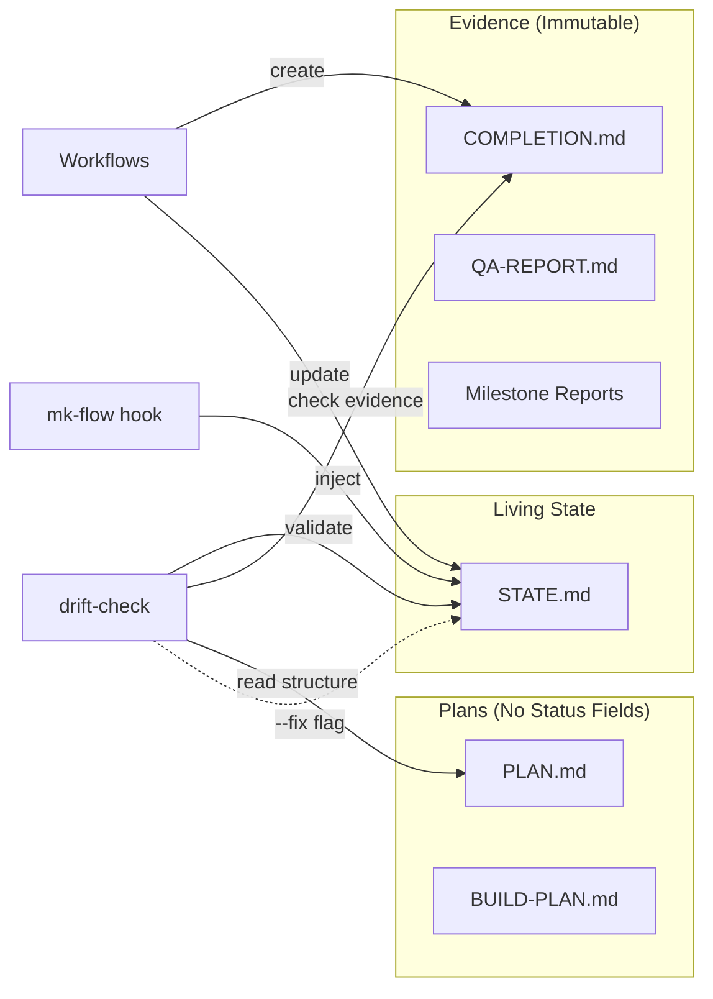

# Plan: State Consolidation — Single Source of Truth

> **Source:** Direct request — eliminate conflicting status tracking across plugins
> **Created:** 2026-03-22

## Vision

Eliminate state drift across the plugin ecosystem by establishing a single source of truth for project status. Plans (PLAN.md, BUILD-PLAN.md) become immutable intent documents — they describe WHAT to build, not whether it's done. Evidence files (COMPLETION.md, QA-REPORT.md, milestone reports) remain immutable proof of completion. STATE.md becomes the only living status document, validated by drift-check against filesystem evidence. New conversations never present completed work as TODO.

## Architecture Overview

## Module Map

| Module | Purpose | Key Files | Dependencies | Owner (Sprint) |
|--------|---------|-----------|-------------|----------------|
| Templates | Define plan document structure (no status fields) | `architect/templates/plan.md`, `ladder-build/templates/build-plan.md` | None | Sprint 1 |
| Architect workflows | Remove status writes, read STATE.md for current sprint | `architect/workflows/{plan,review,ask}.md` | Templates | Sprint 1 |
| Ladder-build workflows | Remove status writes, read STATE.md for current milestone | `ladder-build/workflows/{execute,build-milestone,continue}.md` | Templates | Sprint 1 |
| Supporting files | State template, status workflow, SKILL.md, hook routing, cross-refs | `state/{templates,workflows,SKILL.md}`, `intent-inject.sh`, `cross-references.yaml` | None | Sprint 1 |
| drift-check | Validate STATE.md against evidence, `--fix` flag for correction | `state/scripts/drift-check.sh` | Sprint 1 complete | Sprint 2 |

## Sprint Tracking

| Sprint | Tasks | Completed | QA Result | Key Changes |
|--------|-------|-----------|-----------|-------------|
| 1 | 4 | 4/4 | PASS (6 notes) | Remove status from plans, update all writers to STATE.md only |
| 2 | 3 | 3/3 | PASS (4 notes, 3 auto-fixes) | Rework drift-check to validate STATE.md against evidence + QA fixes |

## Task Index

| Task | Sprint | File | Depends On |
|------|--------|------|-----------|
| Update templates | 1 | sprints/sprint-1/task-1-update-templates.md | None |
| Update supporting files | 1 | sprints/sprint-1/task-2-update-supporting-files.md | None |
| Update architect workflows | 1 | sprints/sprint-1/task-3-update-architect-workflows.md | Task 1 |
| Update ladder-build workflows | 1 | sprints/sprint-1/task-4-update-ladder-build-workflows.md | Task 1, Task 2 |
| Rewrite drift-check core | 2 | sprints/sprint-2/task-5-rewrite-drift-check-core.md | Sprint 1 |
| Add --fix flag with backup | 2 | sprints/sprint-2/task-6-add-fix-flag.md | Task 5 |
| Fix stale references + defensive patterns (QA) | 2 | sprints/sprint-2/task-7-qa-fixes.md | None (parallel with 5+6) |

## Interface Contracts

| From | To | Contract | Format |
|------|----|----------|--------|
| Workflows | STATE.md | Pipeline Position updates | `stage: <canonical-stage>`, `current_sprint: N`, `Current Focus: <description>` |
| Workflows | COMPLETION.md | Sprint completion evidence | Immutable markdown report (existence = done) |
| Workflows | Milestone reports | Milestone completion evidence | `artifacts/builds/[slug]/milestones/milestone-N-*.md` |
| drift-check | STATE.md | Validation (read) / Correction (--fix) | Read Pipeline Position, compare against evidence, optionally write |
| drift-check | PLAN.md | Sprint structure (read-only) | Sprint numbers, task counts from Sprint Tracking table (no Status column) |
| drift-check | BUILD-PLAN.md | Milestone structure (read-only) | Milestone numbers, names, "Done when" criteria (no Status fields) |
| mk-flow hook | STATE.md | Inject into conversation | Raw `cat` — no validation, no side effects |

### STATE.md Write Protocol

Multiple workflows write to STATE.md. Explicit ownership:

| Writer | Section | When | Value |
|--------|---------|------|-------|
| architect plan | Pipeline Position (stage, plan, current_sprint) | After plan creation | `sprint-1`, path, 1 |
| ladder-build execute | Pipeline Position (stage, current_sprint) | After sprint execution | `sprint-N-complete`, N |
| architect review | Pipeline Position (stage, current_sprint) | After QA review | `sprint-(N+1)` or `complete`, N+1 or done |
| ladder-build build-milestone | Current Focus, Done (Recent) | After milestone completion | Updated milestone description |
| drift-check --fix | Pipeline Position only | When evidence contradicts claim | Corrected stage value |

## Decisions Log

| # | Decision | Choice | Rationale | Alternatives Considered | Date |
|---|----------|--------|-----------|------------------------|------|
| D1 | drift-check auto-correction | Report-only by default. `--fix` flag corrects Pipeline Position only. | Wrong auto-corrections are worse than stale status. All 4 perspective agents cautioned against default auto-correction. Pipeline Position is the only section derivable from filesystem evidence. | (a) Auto-correct by default — rejected: blast radius (every future conversation) (b) Separate corrector script — rejected: unnecessary complexity | 2026-03-22 |
| D2 | Sprint Tracking table | Remove Status column. Keep Sprint, Tasks, Completed, QA Result, Key Changes. | Status drifts because it's continuously mutable. Completed (3/3) and QA Result (PASS) are written once — they're evidence, not state. | (a) Remove entire table — rejected: loses useful structure (b) Keep Status read-only — rejected: reintroduces drift | 2026-03-22 |
| D3 | Task Index table | Remove Status column. Keep Task, Sprint, File, Depends On. | Same rationale as D2. Task completion is evidenced by COMPLETION.md. | Keep Status — rejected: same drift vector | 2026-03-22 |
| D4 | BUILD-PLAN.md scope | Remove both per-milestone `**Status:**` AND top-level `## Status` section. | Top-level Status is a cache of per-milestone Status. Removing one without the other creates inconsistency. | Keep top-level — rejected: same staleness problem | 2026-03-22 |
| D5 | Task-spec Status field | Keep. Within-session execution tracking, not cross-session state. | Task-spec Status is consumed by one executor run, never read in a new session. The drift problem is cross-session. | Remove for consistency — rejected: executor needs per-task progress | 2026-03-22 |
| D6 | Existing artifact migration | Leave old Status fields as inert historical data. No migration. | Old fields are unread prose after the change. Stripping them is churn for zero benefit. | Strip old fields — rejected: unnecessary risk | 2026-03-22 |
| D7 | Hook-level drift correction | Not in scope. Correction via /status only. | Adding writes to the hook changes its read-only contract and introduces race conditions on Windows. Can be revisited if /status-based correction proves insufficient. | (a) Lightweight hook check — deferred (b) Full drift-check in hook — rejected: too slow | 2026-03-22 |
| D8 | Backup before correction | Mandatory. `drift-check --fix` creates `.STATE.md.bak`. | Single source of truth = single point of failure. Backup is cheap insurance. | No backup — rejected: irrecoverable if correction is wrong | 2026-03-22 |
| D9 | Atomic plugin update | All three plugins (mk-flow, architect, ladder-build) bump together. | Old drift-check + new templates = "UNKNOWN STATUS." Partial upgrade is hazardous. | Incremental — rejected: transitional inconsistency | 2026-03-22 |

## Risk Register

| Risk | Likelihood | Impact | Mitigation | Status |
|------|-----------|--------|-----------|--------|
| Workflow text change missed — some file still writes status to plan | Med | Med | FF2: grep all workflow files for status-write patterns post-sprint | Active |
| drift-check rewrite introduces regression | Med | High | Sprint 2: test fixtures validating all verdict paths | Active |
| Multi-writer conflicts on STATE.md | Low | Med | Explicit write protocol (see Interface Contracts) | Active |
| User confusion: Sprint Tracking without Status column | Low | Low | Completed + QA Result columns implicitly convey status | Active |

## Change Log

| Date | What Changed | Why | Impact on Remaining Work |
|------|-------------|-----|-------------------------|
| 2026-03-22 | Initial plan created | Eliminate state drift across plugins | — |
| 2026-03-22 | Sprint 1 QA: PASS (6 notes) | 4/4 tasks, 25/27 criteria (2 grep-pattern issues). QA found 2 missed files (intake/parsing-rules.md, mk-flow-init/SKILL.md) and drift-check transition risk (Sprint 2 scope). | Sprint 2 expanded: 3 tasks (2 original + 1 bundled QA fix task). User accepted all 5 improvements. |
| 2026-03-22 | Sprint 2 QA: PASS (4 notes, 3 auto-fixes) | 25/26 criteria passed. QA found CRLF parsing bug, grep-pipefail crash, BUILD-PLAN.md misidentification, FF8 gap. All 3 critical/high issues auto-fixed. | Pipeline complete — all Vision requirements addressed, all fitness functions passing. |

## Fitness Functions

- [x] No workflow file instructs writing Status to PLAN.md Sprint Tracking or BUILD-PLAN.md milestones
- [x] PLAN.md template Sprint Tracking table has no Status column
- [x] PLAN.md template Task Index table has no Status column
- [x] BUILD-PLAN.md template has no `**Status:**` fields and no `## Status` section
- [x] Every workflow that creates COMPLETION.md also updates STATE.md
- [x] drift-check.sh with `--fix` is idempotent (running twice = same STATE.md)
- [x] Only STATE.md contains mutable pipeline stage values (grep across artifacts/ and plugins/)
- [x] Every plan-writing workflow contains explicit "Do NOT write a Status column" prohibition
- [x] continue.md contains explicit prohibition against reading BUILD-PLAN.md for status
- [x] drift-check.sh handles both old-format (with Status column) and new-format (without) plans
