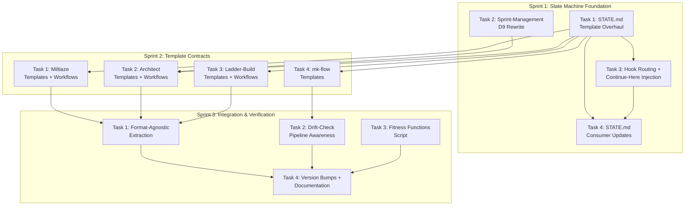

# Plan: Workflow Clarity — D1-D12 Remediation

> **Source:** artifacts/explorations/2026-03-29-workflow-clarity-exploration.md + artifacts/audits/2026-03-29-coherence-audit-report.md
> **Created:** 2026-03-29

## Vision

Implement the 12 design decisions (D1-D12) from the workflow clarity exploration across all pipeline skills (architect, ladder-build, miltiaze, mk-flow). The codebase currently has zero full implementations of any decision — D2 and D10 are entirely absent, D9 is actively contradicted, and D1 is violated by free-text fields. This remediation makes the pipeline internally coherent: skills self-orient from enriched Pipeline Position with artifact path fields (Solution A), handoffs use standardized contracts instead of hardcoded coupling (Solution B), and the groundwork is laid for user-facing ceremony (Solution C).

## Architecture Overview

**Dependency logic:** Sprint 1 establishes the state shape and routing that all subsequent work depends on. Sprint 2 applies D2/D4/D5/D10 template changes that reference the Sprint 1 structures. Sprint 3 integrates cross-cutting concerns (format-agnostic extraction needs metadata from Sprint 2; drift-check extension needs both new state shape and new template shapes).

## Module Map

| Module | Purpose | Key Files | Dependencies | Owner (Sprint) |
|--------|---------|-----------|-------------|----------------|
| STATE.md template | Ground truth for all state operations | `plugins/mk-flow/skills/state/templates/state.md` | None (leaf node) | Sprint 1 |
| intent-inject.sh | Hook — context injection + routing | `plugins/mk-flow/hooks/intent-inject.sh` | STATE.md template (stage list) | Sprint 1 |
| sprint-management.md | Sprint design reference | `plugins/architect/skills/architect/references/sprint-management.md` | None (leaf node) | Sprint 1 |
| STATE.md consumers | Workflows + SKILL.md routing that read/write STATE.md | 7 files across architect, ladder-build, miltiaze, mk-flow | STATE.md template, hook | Sprint 1 |
| Miltiaze templates | Exploration + requirements output templates | `plugins/miltiaze/skills/miltiaze/templates/` + workflows | STATE.md template | Sprint 2 |
| Architect templates | Plan, task-spec, audit-report templates | `plugins/architect/skills/architect/templates/` + workflows | STATE.md template, sprint-management.md | Sprint 2 |
| Ladder-build templates | Build-plan, milestone-report templates | `plugins/ladder-build/skills/ladder-build/templates/` + workflows | STATE.md template | Sprint 2 |
| mk-flow templates | Continue-here, state templates | `plugins/mk-flow/skills/state/templates/` | STATE.md template | Sprint 2 |
| Cross-cutting integration | kickoff.md extraction, drift-check, fitness functions | `kickoff.md`, `drift-check.sh`, new `verify-templates.sh` | All templates, all workflows | Sprint 3 |

## Sprint Tracking

| Sprint | Tasks | Completed | QA Result | Key Changes | Boundary Rationale |
|--------|-------|-----------|-----------|-------------|-------------------|
| 1 | 4 | 4/4 | PASS (5 notes) | State machine foundation: template overhaul, D9 rewrite, hook routing, consumer updates. 3 autonomous fixes (execute.md, audit.md enrichment fields + consumer list). | Decision gate: verify skills can self-orient from new state shape before layering template contracts on top |
| 2 | 5 | 5/5 | PASS (4 notes) | Template standardization: metadata, adversarial sections, boundary rationale, dual verification across all 4 plugins + hook QA fixes (M1-M3). 4 autonomous fixes (FF-17 instruction in audit.md + requirements.md, casing normalization in execute.md, continue-here defaults). | Decision gate: verify all templates are coherent before doing cross-cutting integration that depends on them |
| 3 | 4 | 4/4 | PASS (5 notes) | Integration: format-agnostic extraction, drift-check pipeline awareness, fitness functions, version bumps. 3 autonomous fixes (FF-16 consumer list, FF-17 status.md instruction, FF-17 script independence). 2 critical notes (drift-check format detection, pre-existing fix_state bug). | Natural completion: all remediation actions addressed, fitness functions verify coherence |

## Task Index

| Task | Sprint | File | Depends On |
|------|--------|------|-----------|
| STATE.md Template Overhaul | 1 | sprints/sprint-1/task-1-state-template.md | None |
| Sprint-Management D9 Rewrite | 1 | sprints/sprint-1/task-2-sprint-management.md | None |
| Hook Routing + Continue-Here | 1 | sprints/sprint-1/task-3-hook-routing.md | Task 1 |
| STATE.md Consumer Updates | 1 | sprints/sprint-1/task-4-consumer-updates.md | Tasks 1, 3 |
| Miltiaze Templates + Workflows | 2 | sprints/sprint-2/task-1-miltiaze-templates.md | Sprint 1 |
| Architect Templates + Workflows | 2 | sprints/sprint-2/task-2-architect-templates.md | Sprint 1 |
| Ladder-Build Templates + Workflows | 2 | sprints/sprint-2/task-3-ladder-build-templates.md | Sprint 1 |
| mk-flow Templates + Migration | 2 | sprints/sprint-2/task-4-mk-flow-templates.md | Sprint 1 |
| Hook QA Fixes | 2 | sprints/sprint-2/task-5-hook-qa-fixes.md | Sprint 1 |
| Format-Agnostic Extraction + Metadata Normalization | 3 | sprints/sprint-3/task-1-extraction-and-metadata.md | Sprint 2 |
| Drift-Check Pipeline Awareness | 3 | sprints/sprint-3/task-2-drift-check-pipeline.md | Sprint 2 |
| Fitness Functions + Hook Fixes | 3 | sprints/sprint-3/task-3-fitness-and-hook.md | Sprint 2 |
| Version Bumps + Documentation | 3 | sprints/sprint-3/task-4-version-bumps.md | Sprint 3 tasks 1-3 |

## Interface Contracts

| From | To | Contract | Format |
|------|----|----------|--------|
| STATE.md template | All SKILL.md routing | Canonical stage list | Fenced code block in template, referenced by all consumers |
| STATE.md template | intent-inject.sh | Stage names for routing rules | Same stage list, hook routing section matches 1:1 |
| STATE.md template | drift-check.sh | Pipeline Position field names | Field names match grep patterns in drift-check |
| Skill outputs | Next skill intake | Standardized metadata | Blockquote front matter: `> **type:** ...`, `> **output_path:** ...`, `> **key_decisions:** ...`, `> **open_questions:** ...` |
| .continue-here.md | intent-inject.sh | Resume context injection | File presence = inject; staleness = compare file age to STATE.md |
| Workflows | Templates | Section generation | Each workflow step maps 1:1 to a template section |

**Metadata format decision:** Blockquote (`> **field:** value`) matching existing template conventions. Not YAML front-matter — avoids introducing a new parsing convention. All 10 pipeline templates use this format.

**Extraction pattern:** The metadata block is always the FIRST set of consecutive blockquote lines in the file (before the `# Title`). Core fields always present: `type`, `output_path`, `key_decisions`, `open_questions`. All field names use snake_case. Parse by field name, not position — domain-specific fields vary per template type but the core 4 are guaranteed.

**Metadata field schema:**
- `type`: enum — `exploration`, `requirements`, `plan`, `task-spec`, `audit-report`, `build-plan`, `milestone-report`, `completion-report`, `qa-report`, `state`, `continue-here`
- `output_path`: relative path template — e.g., `artifacts/designs/[slug]/PLAN.md`
- `key_decisions`: bullet list of decisions made in this artifact
- `open_questions`: bullet list of unresolved questions (empty = none)

## Decisions Log

| # | Decision | Choice | Rationale | Alternatives Considered | Date |
|---|----------|--------|-----------|------------------------|------|
| 1 | Metadata format | Blockquote (`> **field:** value`) | Matches existing template conventions used by all templates. YAML front-matter would introduce a new parsing convention. | YAML front-matter (rejected: new convention), inline key-value (rejected: not structured) | 2026-03-29 |
| 2 | Canonical stage spec location | Promoted visible fenced code block in state.md template | Already exists as HTML comment. Keeping it in the template (not a separate file) eliminates drift. Fenced code block is grep-parseable by drift-check. | cross-references.yaml (rejected: changes semantic contract of that file), dedicated pipeline-stages.yaml (rejected: new file to maintain) | 2026-03-29 |
| 3 | Pipeline Position enrichment | Include all 4 fields (build_plan, task_specs, completion_evidence, last_verified) | D7 (15-item hard limit) relaxed per user — it's a useful design smell signal but not a hard constraint. The 4 fields enable skills to auto-discover artifact paths without fallback questions, which is a core goal of Solution A. | Defer all 4 fields (rejected by user: D7 not considered a real constraint), add 2 of 4 (rejected: partial solution creates inconsistency) | 2026-03-29 |
| 4 | "Next Up" handling | Rename to "Planned Work" (state-descriptive, not action-oriented) | Fixes D1 violation (no free-text next_action) while preserving human readability. Full removal creates UX gap — "Planned Work" tells users what's scoped without implying action. | Full removal (rejected: UX regression, users lose intuitive planning section), keep as-is (rejected: violates D1) | 2026-03-29 |
| 5 | Adversarial assessment section naming | Contextual per template type | Exploration: "Where This Can Fail" (existing convention). Plan/audit: "Adversarial Assessment". Milestone: "What Could Be Wrong". Same purpose, name fits context. | Uniform "## Adversarial Assessment" everywhere (rejected: ignores existing naming in exploration template) | 2026-03-29 |
| 6 | Task manifest per sprint | Deferred — not in audit's 10 actions | Interface perspective flagged this gap. But the audit's 10 actions don't include it, and PLAN.md Task Index already serves as a manifest by listing file paths. Adding a separate manifest per sprint is incremental value. | Add as Action 11 (rejected: scope creep beyond audit findings), add inline to PLAN.md (already there via Task Index) | 2026-03-29 |
| 7 | Hook complexity management | Accept ~250 lines, add smoke test | The hook gains ~30 lines from routing expansion and ~20 from .continue-here.md injection (~259 total). Still manageable. Splitting into modules adds complexity without proportional benefit. A smoke test (Sprint 3) is the better investment. | Split into composable modules (rejected: adds abstraction for a single file), keep as-is with no testing (rejected: too risky for critical infrastructure) | 2026-03-29 |
| 8 | Sprint boundaries | D9-compliant decision gates | Sprint 1→2: can skills self-orient? Sprint 2→3: are templates coherent? Sprint 3→done: fitness functions pass. Each boundary is a genuine verification point, not a process-driven size limit. | Size-based splits (rejected: violates D9), single mega-sprint (rejected: no verification points) | 2026-03-29 |

## Refactor Requests

| From Sprint | What | Why | Scheduled In | Status |
|-------------|------|-----|-------------|--------|
| 1 | Hook XML injection guard for .continue-here.md | QA M1: crafted file could inject arbitrary XML tags | Sprint 2 (Task 5) | done |
| 1 | Hook size guard for .continue-here.md injection (~10KB cap) | QA M2: large files could exhaust context budget | Sprint 2 (Task 5) | done |
| 1 | Routing ambiguity fix: qualify PLAN.md fallback with stage check | QA M3: conflicting suggestions when idle + PLAN.md exists | Sprint 2 (Task 5) | done (incomplete — see H1 below) |
| 1 | "Next Up" → "Planned Work" migration in mk-flow-update | QA M4: existing projects need clean upgrade path | Sprint 2 (Task 4) | done |
| 1 | execute.md Current Focus state-descriptive language | QA M5: "Awaiting" is borderline action-oriented | Sprint 2 (Task 3) | done |
| 2 | PLAN.md fallback routing: expand stage exclusion to all stage-specific rules | QA H1: M3 fix only excluded idle/complete; sprint-N-complete and reassessment also conflict | Sprint 3 (Task 3) | done |
| 2 | Metadata placement convention: standardize metadata-first across all templates | QA M2: 5 templates use title-first, 4 use metadata-first; inconsistent for extraction | Sprint 3 (Task 1) | done |
| 2 | pause.md: add "state description, not action" instruction for Current Focus | QA FF-17: 1 of 3 failing files not in Sprint 2 scope | Sprint 3 (Task 3) | done |
| 3 | drift-check parse_design_sprints: detect format from header names, not column count | QA C1: 6-column tables without Status column misidentified as old format | Sprint 3 (QA fixes) | done |
| 3 | drift-check fix_state: align format to match fix_pipeline_fields | QA C2: fix_state uses `^stage:` format, STATE.md uses `- **Stage:**`. Non-functional. | Sprint 3 (QA fixes) | done |
| 3 | drift-check: strip trailing descriptions from artifact paths before validation | QA H1: paths with `— description` suffix cause false DRIFT reports | Sprint 3 (QA fixes) | done |
| 3 | drift-check: use array for artifact_checks instead of space-separated string | QA H2: paths with spaces would corrupt iteration | Sprint 3 (QA fixes) | done |
| 3 | verify-templates.sh: use git rev-parse for BASE path resolution | QA M6: relative path counting is fragile to directory restructuring | Sprint 3 (QA fixes) | done |
| 3 | verify-templates.sh FF-19: allow digits in snake_case field names | QA L1: regex rejects `sprint_2_count` style names | Sprint 3 (QA fixes) | done |

## Risk Register

| Risk | Likelihood | Impact | Mitigation | Status |
|------|-----------|--------|-----------|--------|
| D7 relaxed — field count may exceed 15 | Low | Low | D7 serves as a design smell signal, not a hard constraint. Monitor for genuine complexity creep but don't block useful fields. | Active |
| Adversarial sections become boilerplate | Medium | Medium | Template instructions include concrete prompts ("State 3 specific ways this could fail"). QA flags generic content. | Active |
| Hook .continue-here.md injection breaks on Windows stat differences | Medium | Medium | Use portable file age comparison (file modification time via bash test -nt operator, not GNU stat). Smoke test on Windows. | Active |
| Template metadata format inconsistency across skills | Low | High | Metadata schema specified in Decisions Log #1. Format is blockquote (existing convention). Sprint 2 QA verified all 10 templates. Placement inconsistency (metadata-first vs title-first) noted — standardize in Sprint 3. | Resolved (Sprint 3 Task 1) |
| PLAN.md fallback routing conflicts with stage-specific rules | Medium | Medium | M3 fix excluded idle/complete but not sprint-N-complete or reassessment. Routing is natural language (Claude resolves conflicts by specificity), but ambiguity should be eliminated. Sprint 3 fix scheduled. | Resolved (Sprint 3 Task 3) |
| Standalone vs pipeline path divergence widens | Low | Medium | Action 9 extends drift-check to handle both paths. Cross-reference rule tracks the asymmetry. Full convergence deferred. | Active |
| Old artifacts missing new metadata cause skill fallback failures | Low | Medium | Skills must handle "no metadata present" gracefully. Only future outputs follow new contracts. Documented in Sprint 2 task specs. | Active |

## Change Log

| Date | What Changed | Why | Impact on Remaining Work |
|------|-------------|-----|-------------------------|
| 2026-03-29 | Initial plan created | Architect plan from exploration (12 decisions) + audit (74 findings, 10 actions) | — |
| 2026-03-29 | Decision #3 amended: Pipeline Position enrichment included | User confirmed D7 is not a hard constraint — include all 4 enrichment fields | Task 1 scope expanded to add 4 Pipeline Position fields to STATE.md template |
| 2026-03-29 | Sprint 1 QA: 3 autonomous fixes | execute.md and audit.md were missing 4 enrichment fields; audit.md missing from consumer list. Planning gap in Task 4 (consumer list had 8 entries, task targeted 7 different files). | execute.md, audit.md Pipeline Position blocks updated. Consumer list expanded to 8 entries. |
| 2026-03-29 | Sprint 1 QA: 5 medium-priority improvements noted | M1-M5 in QA-REPORT.md. User decision pending on inclusion in Sprint 2. | May add tasks to Sprint 2 depending on user response. |
| 2026-03-29 | Sprint 2 QA: PASS (4 notes) | 43/44 criteria verified. 4 autonomous fixes (FF-17 audit.md + requirements.md, casing in execute.md, continue-here defaults). 1 High (H1: routing fallback scope), 3 Medium (M1-M4). | 3 items scheduled for Sprint 3 (routing fix, metadata placement, pause.md FF-17). Sprint 3 task specs incorporate QA findings. |
| 2026-03-29 | Sprint 3 QA: PASS (5 notes) | 42/43 criteria verified. 3 autonomous fixes (FF-16 consumer list in state.md, FF-17 status.md instruction, FF-17 verify-templates.sh independence). 2 Critical notes (drift-check format detection, pre-existing fix_state bug). | Initial QA surfaced 6 refactor requests. |
| 2026-03-29 | Sprint 3 QA: all 6 refactor requests resolved | User chose to fix all 6: R1 format detection (header names), R2 fix_state alignment, R3 path description stripping, R4 array-based iteration, R5 git rev-parse for BASE, R6 digit-safe snake_case. | Pipeline complete. 0 deferred items. |

## Fitness Functions

- [ ] FF-1: Every pipeline template has standardized metadata block (type, output_path, key_decisions, open_questions)
- [ ] FF-2: Every assessment/completion template has an adversarial self-assessment section
- [ ] FF-3: Every completion template has BOTH AC checklist AND verification prose
- [ ] FF-4: No template contains "For: [SkillName]" consumer-naming directive
- [ ] FF-5: STATE.md template has no "Next Up" section (has "Planned Work" instead)
- [ ] FF-6: Canonical stage list includes all 8 stages (idle, research, requirements-complete, audit-complete, sprint-N, sprint-N-complete, reassessment, complete)
- [ ] FF-7: intent-inject.sh has routing rules for all 8 canonical stages + fallback for unknown
- [ ] FF-8: Pipeline Position has all required fields when stage is active (build_plan, task_specs, completion_evidence, last_verified)
- [ ] FF-9: Current Focus instructions in all workflows use state-descriptive language
- [ ] FF-10: No workflow in ladder-build hardcodes miltiaze section names
- [ ] FF-11: Every SKILL.md routing section references canonical stage spec, not a local copy
- [ ] FF-12: sprint-management.md does not use task count as primary split criterion
- [ ] FF-13: .continue-here.md injection has staleness check and first-message-only gate
- [ ] FF-14: drift-check.sh validates both standalone (BUILD-PLAN.md) and pipeline (PLAN.md) modes
- [ ] FF-15: Every workflow that writes Pipeline Position must include ALL 9 fields from the STATE.md template
- [ ] FF-16: Canonical Pipeline Stages consumer list must include every file that reads or writes stage values
- [ ] FF-17: Every workflow that writes Current Focus must include explicit "state description, not action" instruction
- [ ] FF-18: Every workflow that generates an inline template (COMPLETION.md, QA-REPORT.md) must include the 4 core metadata fields (type, output_path, key_decisions, open_questions)
- [ ] FF-19: All metadata field names in the core 4 fields must use snake_case consistently across all templates
- [ ] FF-20: The PLAN.md fallback routing rule must only fire when no stage-specific rule above already matched

## Adversarial Assessment

**Where this plan could fail:**

1. **Template changes are additive but workflows may not generate the new sections.** Each new template section (metadata, adversarial, boundary rationale) needs a corresponding workflow step. If a workflow step is missed, the section silently won't appear in output. Sprint 2 must pair every template change with its workflow change in the same task. Verification: invoke each skill after Sprint 2 and check output contains all sections.

2. **D9 rewrite may over-correct.** sprint-management.md currently provides useful sizing heuristics. If the D9 rewrite strips all sizing guidance in favor of pure decision-gate language, the context-health guardrail function is lost. The rewrite must preserve sizing as a secondary signal. Verification: check that context_health section still has clear thresholds.

3. **The canonical stage list promotion creates a visibility change.** Moving from HTML comment to visible section means the stage list appears in every project's STATE.md output. If users find this noisy, it could be reverted. Mitigation: the list is a fenced code block at the bottom of the Pipeline Position section, clearly marked as reference.

4. **Cross-references.yaml may need new rules for the remediation's own coupling.** The remediation introduces new coupling points (metadata format, canonical spec reference). If these aren't added to cross-references.yaml, future changes may miss coupled files. Sprint 3 should verify and extend cross-reference rules.

5. **Task manifest per sprint is deferred.** This was a key component of Solution B. PLAN.md Task Index already lists file paths, so a separate manifest is incremental value. If handoff friction persists after this remediation, add it.
