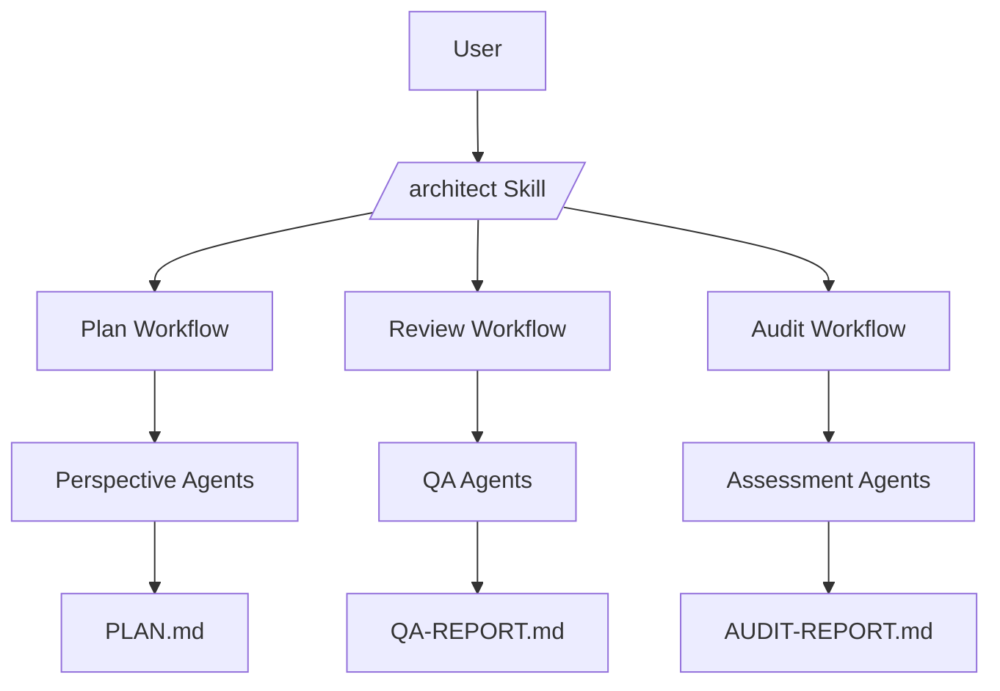

<architecture_patterns>

<overview>
Patterns and frameworks the architect uses when designing systems. Not a textbook — a practical toolkit for making structural decisions.
</overview>

<module_decomposition>

<bounded_contexts>
From Domain-Driven Design. A bounded context is a boundary within which a specific domain model and vocabulary is valid. Use as a thinking tool for module boundaries.

**When to apply:** Deciding what should be a separate module vs. part of an existing one.

**Key questions:**
- Does this concept have a different meaning in different parts of the system? → separate modules
- Do these two pieces share vocabulary but different behavior? → separate bounded contexts
- Would changing one piece require changing the other? → same module (or explicit interface between them)

**Practical rule:** If two components can be described, built, and tested independently, they belong in separate modules. If they share so much state or logic that separating them creates more interfaces than simplification, keep them together.
</bounded_contexts>

<dependency_rules>
Dependencies flow ONE direction. If A depends on B, B must never depend on A.

**Layering pattern:**
```
Core (data models, types, constants)
  ↑
Logic (business rules, processing, validation)
  ↑
Integration (APIs, file I/O, external services)
  ↑
Presentation (UI, CLI, output formatting)
```

Each layer depends only on layers below it. Never skip layers — presentation talks to logic through integration, not directly.

**Dependency inversion for flexibility:** When module A needs to call module B but you don't want A to depend on B directly, define an interface (protocol/contract) that B implements and A consumes. A depends on the interface, not the implementation.

**Practical check:** Draw the dependency graph. If it has cycles, something is wrong. Break cycles by extracting shared concepts into a lower-level module.
</dependency_rules>

<module_boundaries>
Good module boundaries have these properties:

- **High cohesion within:** Everything in the module serves the same purpose. If you can't describe the module's purpose in one sentence, it's doing too much.
- **Low coupling between:** Modules interact through narrow, well-defined interfaces. Changing a module's internals never requires changing another module.
- **Single owner:** Each module belongs to one sprint/task. If two tasks need to modify the same module, either the module is too large or the tasks are too coupled.
- **Testable in isolation:** You can verify a module's behavior without setting up the entire system.

**Anti-patterns:**
- God module — one module that everything depends on and that does everything
- Leaky abstraction — module internals are used directly by consumers instead of through the interface
- Circular dependency — A imports B which imports A
- Feature envy — module A mostly accesses data from module B (should that logic live in B instead?)
</module_boundaries>

</module_decomposition>

<structural_documentation>

<c4_model>
Simon Brown's four-level approach to architecture documentation. For most skill-based projects, levels 1-2 are sufficient.

**Level 1 — System Context:** What is the system, who uses it, what external systems does it interact with?
**Level 2 — Container:** What are the major deployable/runnable pieces? (For this codebase: plugins, skills, hooks, CLI tools)
**Level 3 — Component:** What are the significant modules within each container?
**Level 4 — Code:** Class/function level detail — usually too detailed for architecture docs.

Use Mermaid for diagrams. GitHub renders natively. LLMs generate it fluently.


</c4_model>

<interface_contracts>
Every boundary between modules needs a contract — what data passes, in what format, with what guarantees.

**Contract specification includes:**
- Input: what the consumer provides (structure, types, required fields)
- Output: what the producer returns (structure, types, guarantees)
- Error handling: what happens when input is invalid or processing fails
- Versioning: how the contract changes over time without breaking consumers

**For this codebase (declarative-config):** Contracts are file paths and markdown structures. The "interface" is: where does the file live, what sections does it have, what fields are required. The architect documents these in the PLAN.md Interface Contracts table.
</interface_contracts>

</structural_documentation>

<design_decisions>

<adr_pattern>
Architecture Decision Records (ADRs) capture significant technical decisions. The architect uses the Decisions Log in PLAN.md rather than separate files (keeping decisions co-located with the plan they affect).

**What makes a decision "architecturally significant":**
- It affects the structure of the code (module boundaries, dependencies, interfaces)
- It constrains future work (technology choice, pattern adoption)
- It's hard to reverse without significant rework
- Multiple viable options exist (if there's only one obvious choice, no decision to record)

**What to record:**
- The decision itself (what was chosen)
- The alternatives considered (what was rejected)
- The rationale (why this choice, not the others)
- The constraints that shaped the decision

**What NOT to record:**
- Implementation details that don't affect architecture
- Decisions that are obviously dictated by project conventions
- Temporary choices ("we'll use a mock for now")
</adr_pattern>

<fitness_functions>
From Ford/Parsons/Kua's "Building Evolutionary Architectures." Fitness functions are machine-checkable assertions about architectural properties. They verify the architecture is maintained during building.

**Examples for this codebase:**
- "Module A never imports from Module B internals" → grep for import violations
- "Every SKILL.md has all required XML sections" → parse and validate
- "Every plugin.json has name, version, description, author fields" → schema check
- "No circular dependencies between modules" → import graph analysis

**Where they live:** In PLAN.md's Fitness Functions section. QA agents check them during sprint review.

**Key insight:** Fitness functions bridge "design it" and "keep it that way." Without them, architecture degrades during building as shortcuts accumulate.
</fitness_functions>

</design_decisions>

<patterns_for_declarative_config_projects>
When the deliverables are markdown files, YAML configs, and workflow documents (like this codebase):

- **Files are all-or-nothing.** There's no "stub" version of a workflow document. You write it complete or it doesn't work. Plan milestones around complete capabilities, not partial files.
- **The "interface" is the file path and structure.** Where does the file live? What sections does it contain? What fields are required? Document these as contracts.
- **Testing means real usage.** You can't unit-test a SKILL.md. Verification means invoking the skill and seeing if it behaves correctly.
- **Cross-file consistency is the main risk.** A routing table that references a workflow file that doesn't exist. A template referenced in a workflow that has different sections than expected. Cross-references and impact maps are critical.
</patterns_for_declarative_config_projects>

</architecture_patterns>
