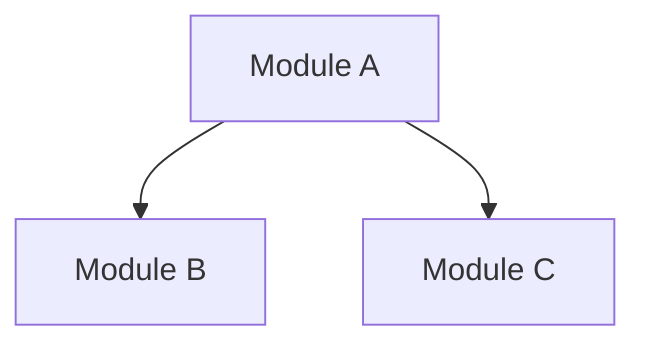

<template>

Use this structure for PLAN.md — the architect's living master plan. This is the "Jira board" equivalent. Updated after every sprint.

Save to: `artifacts/designs/[slug]/PLAN.md`

```markdown
# Plan: [Feature/Project Name]

> **Source:** [Path to miltiaze requirements/exploration, or audit report, or "Direct request"]
> **Created:** [YYYY-MM-DD]

## Vision
[From miltiaze or user — what we're building and why, in the client's terms. 2-4 sentences. This is the North Star.]

## Architecture Overview
[Mermaid diagram — the big picture. Updated as understanding evolves.]



## Module Map
[For each module/component in the architecture:]

| Module | Purpose | Key Files | Dependencies | Owner (Sprint) |
|--------|---------|-----------|-------------|----------------|
| [Name] | [What it does] | [File paths] | [What it depends on] | Sprint N |

## Sprint Tracking

| Sprint | Status | Tasks | Completed | QA Result | Key Changes |
|--------|--------|-------|-----------|-----------|-------------|
| 1 | DONE | 3 | 3/3 | PASS (1 note) | [Brief summary] |
| 2 | IN PROGRESS | 3 | 1/3 | — | [Brief summary] |
| 3 | PLANNED | TBD | — | — | Scoped after sprint 2 review |

## Task Index

| Task | Sprint | Status | File | Depends On | Blocked By |
|------|--------|--------|------|-----------|------------|
| [Task name] | N | done/in-progress/planned/blocked | [Path to task spec] | [Task IDs] | [Blocker description] |

## Interface Contracts
[Key interfaces between modules — data that flows between components.]

| From | To | Contract | Format |
|------|----|----------|--------|
| [Module A] | [Module B] | [What data passes] | [Structure/schema] |

## Decisions Log

| # | Decision | Choice | Rationale | Alternatives Considered | Date |
|---|----------|--------|-----------|------------------------|------|
| 1 | [What was decided] | [The choice made] | [Why — context, tradeoffs] | [What else was considered] | YYYY-MM-DD |

## Refactor Requests

| From Sprint | What | Why | Scheduled In | Status |
|-------------|------|-----|-------------|--------|
| [Sprint N] | [What needs refactoring] | [Why — QA finding or architect assessment] | [Sprint M] | pending/done |

## Risk Register

| Risk | Likelihood | Impact | Mitigation | Status |
|------|-----------|--------|-----------|--------|
| [What could go wrong] | Low/Med/High | Low/Med/High | [How to prevent or handle] | Active/Mitigated/Closed |

## Change Log

| Date | What Changed | Why | Impact on Remaining Work |
|------|-------------|-----|-------------------------|
| YYYY-MM-DD | [What was amended] | [Why the change was needed] | [How it affects upcoming sprints] |

## Fitness Functions
[Machine-checkable assertions about architectural properties. Used by QA agents for verification.]

- [ ] [Property assertion — e.g., "Module A never imports from Module B internals"]
- [ ] [Property assertion — e.g., "Every task spec has a pseudocode section"]
- [ ] [Property assertion — e.g., "All public interfaces have type annotations"]
```

</template>

<conventions>
- **Sprint status markers:** PLANNED, IN PROGRESS, DONE, BLOCKED (with reason).
- **Task status markers:** planned, in-progress, done, blocked.
- **QA results:** PASS, PASS (N notes), FAIL (N issues), BLOCKED.
- **Decisions Log:** Entries are never deleted. The history of decisions IS the architectural context. Include alternatives considered — future sessions need to know what was rejected and why.
- **Change Log:** Every amendment is tracked. Nothing changes without a record.
- **Fitness Functions:** These become the QA team's automated verification criteria. Write them as assertions that can be checked by reading the code.
- **Mermaid diagrams:** Keep them simple — C4 Level 1-2. GitHub renders natively. Update after each sprint if the architecture evolved.
</conventions>
